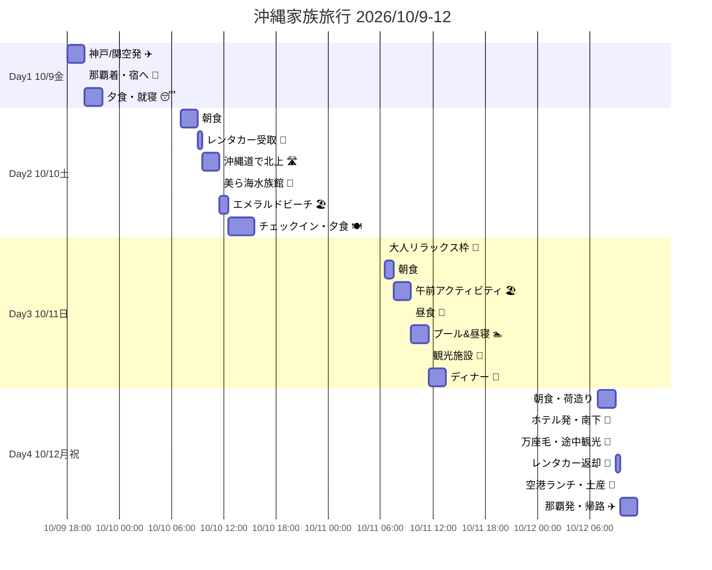

# 沖縄家族旅行プラン 2026年10月9日〜12日（3泊4日）

## 基本情報
- **日程**: 2026年10月9日（金）夜発 〜 10月12日（月・祝）昼〜夕方着
- **出発地**: 神戸空港（UKB）または関西国際空港（KIX）
- **目的地**: 那覇空港（OKA）
- **人数**: 大人2名＋子ども3名（小5・小2・年長、全員男児）
- **車**: 10/10朝〜10/12昼 ファミリーミニバン

---

## ⚠️ 重要な前提
本ドキュメントは**プランニング資料**です。リアルタイムの空席状況・価格は各社サイトで必ずご確認ください。
2026年10月の**第2月曜日（10/12）はスポーツの日（祝日）**で3連休最終日です。人気ホテル・便は早めの押さえを推奨（目安：6〜9ヶ月前）。

---

## 1. 最適化タイムスケジュール

### 🗓 一目でわかる全体スケジュール

| 時間帯 | Day 1 (10/9 金) | Day 2 (10/10 土) | Day 3 (10/11 日) | Day 4 (10/12 月祝) |
|---|---|---|---|---|
| 早朝 6-8 | — | 朝食 | 🧘 散歩/温泉/コーヒーTO | 朝食・荷造り |
| 朝 8-10 | — | 🚗 レンタカー受取 | 朝食 | 🚗 ホテル発・南下 |
| 午前 10-12 | — | 🛣 沖縄道で北上 | 🏖 海／🚲 古宇利／備瀬 | 🗿 万座毛・海中道路 |
| 昼 12-14 | — | 🐠 美ら海水族館 | 🍴 本部ランチ | 🚗 空港レンタカー返却 |
| 午後 14-16 | — | 🐠 美ら海（続き） | 🏊 ホテルプール＆昼寝 | 🍴 空港ランチ・土産 |
| 夕方 16-18 | — | 🏖 エメラルドビーチ | 🍍 パイナップルパーク等 | ✈️ 那覇発 |
| 夜 18-20 | ✈️ 神戸/関空発 | 🍽 ディナー | 🍖 アグー豚/ステーキ | ✈️ 飛行中 |
| 夜 20-22 | 🛬 那覇着 → 🚕 宿 | 😴 就寝 | 😴 就寝 | 🛬 神戸/関空着 |
| 深夜 22- | 😴 就寝 | — | — | — |
| **宿泊** | 🏨 那覇(空港近接) | 🏨 本部町リゾート | 🏨 本部町リゾート(連泊) | 自宅 |

### 📊 ガントチャート（GitHub上でレンダリング）



### 📍 移動距離・所要時間サマリー
| 区間 | 距離 | 所要時間 | 備考 |
|---|---|---|---|
| 那覇市内 → 美ら海水族館 | 約95km | 1h45m〜2h | 沖縄道許田IC経由 |
| 美ら海 → 本部町内ホテル | 約1〜5km | 5〜10分 | オリオンモトブは徒歩圏 |
| ホテル → 古宇利島 | 約18km | 30分 | 橋渡りが絶景 |
| 本部町 → 那覇空港 | 約95km | 2h〜2h30m | 最終日は渋滞警戒 |

---

### 設計思想
- **体力マネジメント**: 年長〜小5の3兄弟。午前に主要アクティビティ、午後は水遊び／プール、夜は早め就寝。連泊で荷造り負担を削減。
- **移動の谷**: 初日夜着＋最終日昼発は移動日扱い。中2日（10/10・11）に核となる体験を集約。
- **雨天バックアップ**: 美ら海水族館・DMMかりゆし水族館・ブセナ海中公園（海中展望塔）を屋内／半屋内の保険として配置。

### Day 1｜10/9（金）移動・那覇泊
| 時間 | 行動 |
|---|---|
| 18:00前後 | 神戸/関空発（推奨便は §2） |
| 20:00〜21:30 | 那覇空港着 → ゆいレール赤嶺 or タクシーで宿へ |
| 21:30〜22:30 | 近所でさっと夕食（ポーたまサンド／ステーキハウス松／A&W等、子連れ深夜対応店） |
| 23:00 | 就寝 |

**ポイント**: 初日のレンタカー受取りは避ける（夜間ピックアップは疲労＆事故リスク増）。翌朝ゆいレールで那覇中心部の営業所へ。

### Day 2｜10/10（土）那覇→美ら海→本部町泊
| 時間 | 行動 |
|---|---|
| 7:00〜8:00 | 朝食（宿またはスペシャルティコーヒー店モーニング） |
| 9:00 | 那覇市内のレンタカー営業所で受取（那覇空港店ではなく**市内店舗**が混雑回避◎） |
| 9:30〜11:30 | 沖縄道北上。途中「許田IC」道の駅でトイレ休憩＆**沖縄そば**軽食 |
| 12:00〜15:30 | **美ら海水族館**（ジンベエザメ前で昼食／イルカショー1回は必見） |
| 16:00〜17:00 | 隣接「エメラルドビーチ」で軽く海遊び（10月は海水温27℃前後、遊泳期間内） |
| 17:30 | ホテルチェックイン（オリオン or マハイナ等） |
| 18:30 | 館内ディナー or 車で5分「道の駅許田近辺」へ |
| 20:30 | 子ども就寝。大人はホテルBar／テラスで一杯 |

### Day 3｜10/11（日）本部町連泊・体力配分デー
| 時間 | 行動 |
|---|---|
| 6:30〜7:30 | **大人リラックス枠**: ビーチ散歩／ホテルジム／朝ヨガ／自家焙煎コーヒーTO |
| 8:00〜9:00 | 朝食ビュッフェ（子ども好きなメニュー多数） |
| 9:30〜11:30 | **午前アクティビティ選択肢**（天候で1つ）<br>A: 瀬底ビーチでSUP／シュノーケル<br>B: 古宇利島ドライブ＋ハートロック<br>C: 備瀬のフクギ並木レンタサイクル |
| 12:00 | 昼食（本部町の軽めランチ：タコライス、沖縄そば） |
| 13:30〜15:30 | **ホテルプール＆昼寝タイム**（体力温存のキモ） |
| 16:00〜17:30 | **ナゴパイナップルパーク** or **OKINAWAフルーツらんど** or **オリオンハッピーパーク**（大人のビール試飲、子どもはジュース） |
| 18:30 | ディナー（§3 食事提案参照：アグー豚／鉄板ステーキ／海鮮） |
| 20:30 | 就寝 |

### Day 4｜10/12（月・祝）本部→那覇→帰路
| 時間 | 行動 |
|---|---|
| 7:00 | 朝食・荷造り |
| 9:00 | ホテル発、南下。途中「万座毛」で15分絶景フォト |
| 10:30〜12:00 | **嘉手納道の駅**（安保の丘）or **海中道路（平安座島）**でドライブ休憩 |
| 12:30 | 那覇空港周辺レンタカー営業所で返却（**フライト2時間前返却**厳守） |
| 13:30〜 | 空港でブルーシール／A&W／沖縄そばランチ＆お土産 |
| 15:00〜17:00目安 | 那覇発 → 神戸/関空着 |

---

## 2. フライト検索リンク（復路は10/12 午後便）

### 候補便（2026年10月時点のスケジュール・目安、要確認）
| 航空会社 | 往路(10/9) 目安 | 復路(10/12) 目安 | 5名料金帯(片道合計) |
|---|---|---|---|
| スカイマーク UKB-OKA | BC523 19:55-22:20 | BC518 12:30-14:35 | 家族割・いま得で¥25,000〜/人程度 |
| ANA KIX-OKA | NH1739 19:30-21:55 | NH1740 13:40-15:55 | スーパーバリュー75等で¥20,000〜 |
| JAL KIX-OKA | JTA90/82系統 夜便 | JTA89系統 午後便 | 先得割引で¥22,000〜 |
| ピーチ KIX-OKA | MM213/217 夜便 | MM214/218 午後便 | ¥9,000〜（荷物別、子連れは要座席指定料） |

### 公式検索リンク（パラメータなしのトップ検索画面）
- **スカイマーク**: https://www.skymark.co.jp/ja/ （UKB→OKA検索）
- **ANA 国内線**: https://www.ana.co.jp/ja/jp/domestic/
- **JAL 国内線**: https://www.jal.co.jp/jp/ja/dom/
- **ピーチ**: https://www.flypeach.com/jp
- **比較系**: https://www.skyscanner.jp/ / https://www.google.com/travel/flights

### 推奨
- **往路**: スカイマーク神戸19:55発（神戸空港が自家用車でアクセス楽、駐車場も関空より割安）
- **復路**: 神戸戻りで同じくSKY便。または連休最終日の混雑を避けるため**12:30発**の早めの便。
- 5名分まとめ予約はANA「いっしょ割」やJAL「おともdeマイル」等家族割も要検討。

---

## 3. ホテル提案

### 1泊目（10/9 那覇・空港近接）- 寝るだけ／5名対応

**候補A: ホテルルートイン那覇泊港**（赤嶺から車5分、泊港近く）
- ファミリールーム or ツインx2隣接可、朝食無料
- 予約: https://www.route-inn.co.jp/hotel_list/okinawa/index_hotel_id_519/

**候補B: ダイワロイネットホテル那覇おもろまち**
- 広めのデラックスルーム（3名定員）+ツイン1室で5名対応可
- 予約: https://www.daiwaroynet.jp/naha-omoromachi/

**候補C: ホテルグレイスリー那覇**（県庁前・国際通り至近）
- 夜の街歩き＆夕食に便利。ファミリールーム有
- 予約: https://gracery.com/naha/

**候補D: 格安・赤嶺駅**: スーパーホテル那覇・新都心 or レッドプラネット那覇
- 5名1室は難しい→ツイン2室を同フロア確保
- 予約: https://travel.rakuten.co.jp/（楽天で「赤嶺駅」絞り込み）

**推奨**: 候補A（ルートイン那覇泊港）— 5名1室対応・朝食・駐車場あり・空港から近い。

### 2〜3泊目（10/10・11 本部町・名護エリア連泊）

**第1候補: オリオンホテル モトブ リゾート&スパ**
- 美ら海水族館**徒歩7分**、ビーチ直結、天然温泉あり
- 5名利用: デラックスツイン（最大4名）+添寝、またはコネクティングルーム
- 公式: https://www.okinawaresort-orion.com/
- 予約: 公式 or https://www.jalan.net/ / https://travel.rakuten.co.jp/

**第2候補: ホテル マハイナ ウェルネスリゾート オキナワ**
- 美ら海まで車5分。広いプール、ファミリー特化、5名1室プラン豊富
- 公式: https://www.mahaina.co.jp/
- 予約: 公式 or 楽天トラベル・じゃらん

**第3候補: ロイヤルビューホテル美ら海**
- 水族館に一番近い。シンプル・コスパ良
- 公式: https://www.royalview.jp/

**第4候補（ちょい贅沢）: ザ・ブセナテラス**
- 名護市喜瀬。子連れに本格リゾート。プール充実、朝食評価高
- 公式: https://www.terrace.co.jp/busena/
- ※美ら海まで車45分と離れる

**推奨**: **オリオンモトブ**（立地最強＋温泉で体力回復）。予算優先なら**マハイナ**。

### 横断検索
- 楽天トラベル: https://travel.rakuten.co.jp/
- じゃらん: https://www.jalan.net/
- 一休（リゾート系）: https://www.ikyu.com/
- Booking.com: https://www.booking.com/
- アゴダ: https://www.agoda.com/

---

## 4. レンタカー（10/10 朝〜10/12 昼、ミニバン5名）

### 推奨クラス
**ワゴン/ミニバン**（トヨタ ヴォクシー／ノア／日産セレナ級）。大人2＋子3＋スーツケースで後席余裕、スライドドアで乗降楽。

### 候補会社（那覇市内店舗で10/10朝ピックアップ／那覇空港店10/12昼返却）
| 会社 | 特徴 | リンク |
|---|---|---|
| OTSレンタカー | 沖縄最大手、チャイルドシート無料、営業所多い | https://www.otsrentacar.co.jp/ |
| オリックスレンタカー | 全国網。空港送迎スムーズ | https://car.orix.co.jp/ |
| トヨタレンタカー | ヴォクシー・アルファード系の新車多め | https://rent.toyota.co.jp/ |
| タイムズカーレンタル | 予約しやすい、クーポン充実 | https://rental.timescar.jp/ |
| ニッポンレンタカー | ハイエースグランドキャビンなど大型も | https://www.nipponrentacar.co.jp/ |

### 横断比較
- **たびらい沖縄**（現地老舗比較、免責補償込の明朗会計）: https://www.tabirai.net/car/okinawa/
- **楽天トラベル レンタカー**: https://travel.rakuten.co.jp/cars/
- **じゃらんレンタカー**: https://www.jalan.net/rentacar/

### オプション推奨
- 免責補償（CDW）+ ノンオペレーションチャージ補償（NOC） 必ず加入
- チャイルドシート x1（年長）、ジュニアシート x2（小2・小5）— ほぼ無料で貸与可
- ETCカード貸出 or 自車ETC持参（沖縄自動車道 許田まで）

---

## 5. 食事の工夫（大人ロカボ × 子ども大満足）

### 本部・名護エリア
| 店 | ジャンル | メモ |
|---|---|---|
| **アグー豚しゃぶしゃぶ わらゐ（本部町）** | アグー豚しゃぶ | 野菜多め・〆省略でロカボ成立。子どもは肉＋卵でOK |
| **ステーキハウス88 名護店** | 鉄板ステーキ | 赤身サーロイン＋サラダでロカボ。子どもはお子様ステーキセット |
| **食堂faidama（名護）** | 琉球ごはん | 島野菜豊富 |
| **海人料理 海邦丸（本部）** | 海鮮定食 | マグロ赤身・刺身盛りでロカボ◎ |
| **PIZZERIA UONAMI（瀬底島）** | 薪窯ピザ | 子ども狂喜、大人はサラダ中心で調整 |
| **百年古家 大家（やんばる）** | 沖縄そば・アグー豚御膳 | 雰囲気抜群、家族向き |

### 那覇（初日夜 or 最終日ランチ）
- **やっぱりステーキ**（深夜営業、子連れOK）
- **ゆうなんぎい**（沖縄料理、国際通り）
- **A&W 牧港店**（ルートビア）

---

## 6. 朝の大人リラックス枠 & コーヒー

### 本部・名護のスペシャルティコーヒー（自家焙煎・テイクアウト可）
| 店 | 所在 | 特徴 |
|---|---|---|
| **Yamada Coffee Okinawa** | 名護市 | ハンドドリップ中心、浅煎り得意 |
| **COFFEE potohoto（系）／CONTE** | 名護 | 朝から営業、TO紙コップあり |
| **オハコルテ ベーカリー**（コーヒー併設） | 那覇・浦添 | 帰路用 |
| **Cafe CAHAYA BULAN** | 本部町備瀬 | 眺望◎ただし朝遅め開店注意 |
| **36 COFFEE** | 本部町 | 地元で評価高い焙煎所 |
| **ZHYVAGO COFFEE ROASTERY WORKS** | 北谷美浜 | 帰路立ち寄り候補 |

### 朝のワークアウト/リラックス
- オリオンホテルモトブ: 専用ビーチ散歩1km＋館内**温泉大浴場**（朝6時〜）
- マハイナ: 屋外プール＆フィットネス
- 周辺: **備瀬のフクギ並木**を早朝散歩（木漏れ日、観光客少なく静か）

---

## 7. 準備チェックリスト（出発2週間前）

- [ ] フライト予約（5名）→ 座席指定（家族並び）
- [ ] ホテル3泊分予約（5名利用プランか要確認）
- [ ] レンタカー予約（ミニバン、チャイルド/ジュニアシート x3）
- [ ] 美ら海水族館の前売券（道の駅許田・コンビニで当日割引可、要比較）
- [ ] 海遊び用: ラッシュガード、マリンシューズ、日焼け止め
- [ ] 10月沖縄の服装: 半袖＋薄羽織、朝晩や冷房対策
- [ ] 子ども用の車内暇つぶし（タブレット、シール、カード）
- [ ] 酔い止め（山道ワインディング対策）
- [ ] 大人のロカボ補食（プロテインバー、素焼きナッツ）

---

## 8. 予算感（5名合計・目安）
| 項目 | 概算 |
|---|---|
| 往復航空券（SKY家族割等） | ¥250,000 〜 ¥350,000 |
| 宿泊 1泊目 | ¥20,000 〜 ¥30,000 |
| 宿泊 2・3泊目（リゾート2泊） | ¥120,000 〜 ¥200,000 |
| レンタカー2.5日+保険 | ¥25,000 〜 ¥35,000 |
| 食事・観光・土産 | ¥80,000 〜 ¥120,000 |
| **合計** | **¥495,000 〜 ¥735,000** |

---

## 9. ホテル詳細比較（5名利用観点）

### 🏨 2・3泊目 本部・名護エリア リゾート比較

| 項目 | オリオン モトブ | マハイナ | ロイヤルビュー美ら海 | ブセナテラス |
|---|---|---|---|---|
| **美ら海まで** | 🟢 徒歩7分 | 🟢 車5分 | 🟢 徒歩すぐ | 🔴 車45分 |
| **5名1室対応** | 🟡 デラックス要問合せ | 🟢 ファミリー豊富 | 🔴 難しい(2室必要) | 🟢 コネクティング/スイート |
| **天然温泉** | 🟢 あり(美らの湯) | 🔴 なし | 🔴 なし | 🔴 なし |
| **プール** | 🟢 屋外+屋内 | 🟢 屋外+スライダー | 🟡 小規模屋外 | 🟢 屋外5つ+屋内 |
| **専用ビーチ** | 🟢 エメラルドB直結 | 🟡 徒歩10分 | 🟡 徒歩 | 🟢 専用ビーチ |
| **朝食評価** | 🟢 高評価(地産ビュッフェ) | 🟢 子ども向け充実 | 🟡 シンプル | 🟢🟢 沖縄屈指 |
| **大人朝リラックス** | 🟢 温泉+ビーチ散歩 | 🟡 プール | 🟡 | 🟢🟢 テラス・散歩道 |
| **キッズ施設** | 🟢 キッズランド | 🟢🟢 特化型 | 🟡 | 🟢 プール充実 |
| **1泊/5名 価格帯** | ¥60-90k | ¥45-70k | ¥35-55k | ¥90-180k |
| **総合コスパ** | 🟢🟢 最適 | 🟢🟢 高 | 🟢 価格重視 | 🟡 贅沢枠 |

**推奨**: 美ら海徒歩圏＋温泉の**オリオン モトブ**が本企画の要件最適解。予算圧縮なら**マハイナ**。

### 🏨 1泊目 那覇・空港近接 比較

| 項目 | ルートイン那覇泊港 | ダイワロイネットおもろまち | グレイスリー那覇 | スーパーホテル新都心 |
|---|---|---|---|---|
| **空港アクセス** | 🟢 車10分 | 🟡 ゆいレール15分 | 🟡 ゆいレール20分 | 🟡 ゆいレール15分 |
| **5名1室** | 🟢 ファミリールーム | 🟡 要問合せ(ツイン2室が現実的) | 🟢 ファミリールーム | 🔴 ツイン2室 |
| **朝食** | 🟢 無料 | 🟡 有料 | 🟡 有料 | 🟢 無料 |
| **駐車場** | 🟢 あり | 🟢 あり(有料) | 🟡 近隣 | 🟡 近隣 |
| **深夜到着対応** | 🟢 24H | 🟢 24H | 🟢 24H | 🟢 24H |
| **価格帯/5名** | ¥20-28k | ¥22-32k | ¥24-35k | ¥18-25k |
| **周辺飲食** | 🟡 限定的 | 🟢 新都心で豊富 | 🟢🟢 国際通り | 🟢 新都心 |

**推奨**: 深夜チェックイン＋翌朝レンタカー取りに動く動線を考慮し、**ルートイン那覇泊港**（朝食無料・駐車場・5名1室可）。飲食重視なら**グレイスリー**。

### 🎯 意思決定フロー

```
2-3泊目の最優先は？
├─ 美ら海徒歩アクセス + 温泉 → オリオン モトブ ★本命
├─ コスパ + 子連れ特化      → マハイナ
├─ 価格最重視               → ロイヤルビュー美ら海
└─ 本格リゾート体験(予算増) → ブセナテラス (美ら海遠い注意)

1泊目の最優先は？
├─ 空港最短＋朝食無料       → ルートイン那覇泊港 ★本命
├─ 夜の国際通り・夕食        → グレイスリー那覇
└─ 最安値優先(2室可)         → スーパーホテル新都心
```

---

## 10. 次のアクション（ユーザー判断事項）
1. 出発空港を**神戸(UKB)** / **関空(KIX)** どちらに確定？
2. 2〜3泊目は**オリオンモトブ**／**マハイナ**／**ロイヤルビュー**／**ブセナ**のどれ？
3. 1泊目は**ルートイン那覇泊港**／**グレイスリー那覇**／**その他**？
4. 予算の上限レンジは？（¥50〜70万の幅で）
5. 10/10午前アクティビティの優先順位（海／ドライブ／サイクリング）
6. マリンアクティビティ（シュノーケル、SUP等）の有無

上記が決まり次第、各予約サイトに直接進めます。
